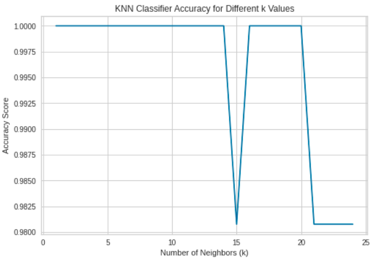
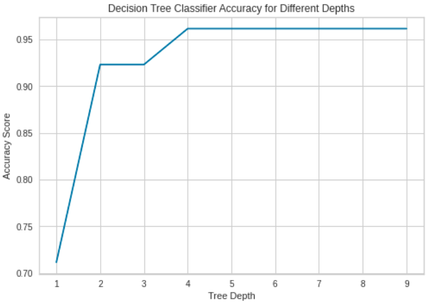
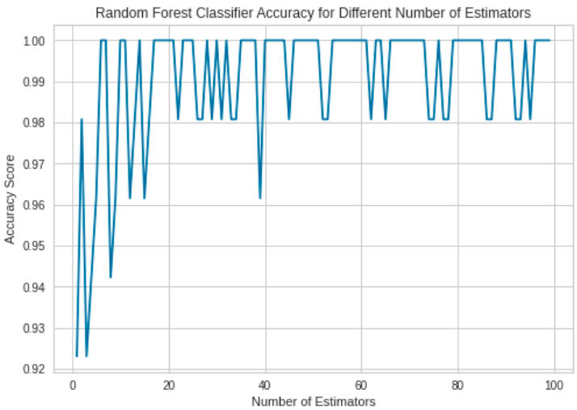
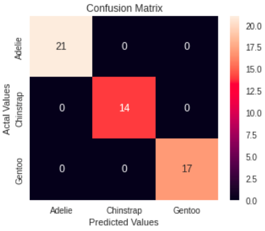

# Penguin Classification using Machine Learning

This repository demonstrates the process of classifying different species of penguins using various machine learning algorithms. The dataset used in this project is based on measurements of penguins, which include features such as culmen length, culmen depth, flipper length, body mass, and isotopic signatures.

## Introduction

The goal of this project is to classify penguin species based on their physical characteristics using machine learning techniques. The dataset includes measurements for three species of penguins: Adelie, Gentoo, and Chinstrap.

## Dataset

The dataset used for this project is `penguins_train.csv`. It includes the following features:
- **Culmen Length (mm)**
- **Culmen Depth (mm)**
- **Flipper Length (mm)**
- **Body Mass (g)**
- **Delta 15 N (o/oo)**
- **Delta 13 C (o/oo)**
- **Sex**

## Data Preprocessing

Data preprocessing involves cleaning and transforming the raw data into a suitable format for machine learning models. Key preprocessing steps include:
- **Dropping irrelevant columns** such as 'Island' and 'Clutch Completion'.
- **Handling missing values** by removing tuples with null values.
- **Filtering and encoding categorical variables** such as 'Sex' into binary values (1 for female, 0 for male).
- **Normalizing numerical features** to ensure they are on a similar scale for better model performance.

## Feature Engineering

Feature engineering is the process of creating new features or modifying existing ones to improve the performance of machine learning models. In this project, feature engineering steps include:
- Encoding the 'Sex' column as binary values.
- Normalizing all numerical features to bring them to a common scale.

## Model Training and Evaluation

Several machine learning models are trained and evaluated on the processed dataset:
- **K-Nearest Neighbors (KNN)**
- **Naive Bayes**
- **Decision Tree**
- **Random Forest**
- **Support Vector Machine (SVM)**

### Training Process

1. **Splitting the dataset** into training and testing sets using `train_test_split`.
2. **Training the models** on the training set and making predictions on the testing set.
3. **Evaluating model performance** using metrics such as F1 score, confusion matrix.

### Evaluation Metrics

- **F1 Score**: Measures the balance between precision and recall.
- **Confusion Matrix**: Visual representation of the true vs. predicted classifications.

## Results

The performance of each model is evaluated based on the metrics mentioned above. The confusion matrix curves provide insights into the strengths and weaknesses of each model in classifying the penguin species.

## Conclusion

This project demonstrates the application of various machine learning algorithms to classify penguin species based on their physical characteristics. The results highlight the importance of data preprocessing, feature engineering, and the choice of appropriate evaluation metrics in building effective machine learning models.

